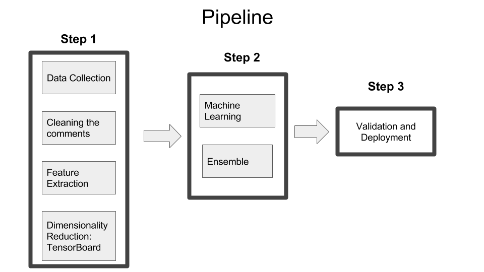
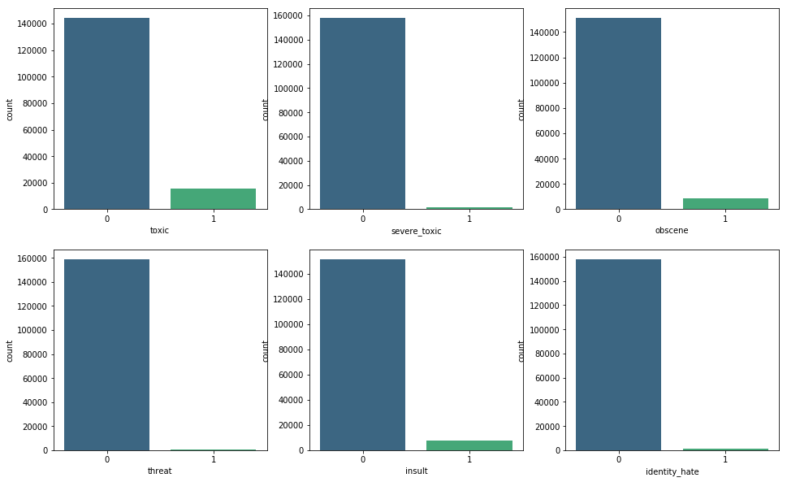
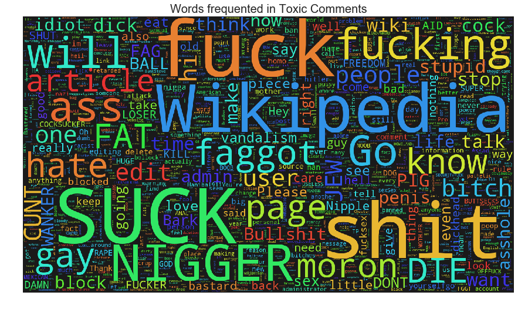
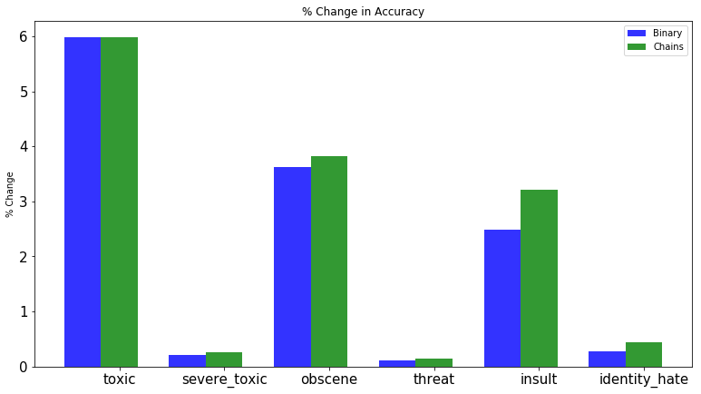
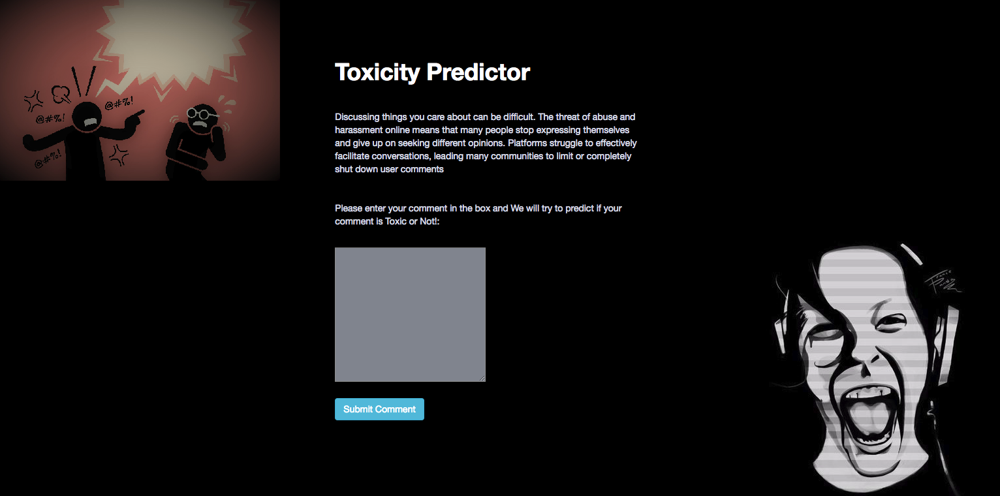

# Identifying Toxic Comments

## Objective:

To build a multi-headed model that’s capable of detecting different types of of toxicity like threats, obscenity, insults, and identity-based comments from Wikipedia’s talk page edits.

## Business Aspect:

To effectively facilitate conversations on online community, leading many communities to limit or completely shut down such user comments.

## Project Description:

Discussing things you care about can be difficult. The threat of abuse and harassment online means that many people stop expressing themselves and give up on seeking different opinions. 
The Conversation AI team, a research initiative founded by Jigsaw and Google (both a part of Alphabet) are working on tools to help improve online conversation. One area of focus is the study of negative online behaviors, like toxic comments (i.e. comments that are rude, disrespectful or otherwise likely to make someone leave a discussion). So far they’ve built a range of publicly available models served through the Perspective API, including toxicity. But the current models still make errors, and they don’t allow users to select which types of toxicity they’re interested in finding (e.g. some platforms may be fine with profanity, but not with other types of toxic content).

## Data

Source: [Kaggle: Toxic Comment Classification Challenge](https://www.kaggle.com/c/jigsaw-toxic-comment-classification-challenge). It consists of large number of Wikipedia comments which have been labeled by human raters for toxic behavior. 
The types of toxicity are:
  a. toxic
  b. severe_toxic
  c. obscene
  d. threat
  e. insult
  f. identity_hate

## Pipeline

### 1. Label/Target Distribution:

                                                   Labels Distribution
                                                  

The data is imbalanced due to skewed label distribution

### Base Accuracy for each Label

  1. Toxic: 90.42 %
  2. Severe_toxic: 99.00 %
  3. Obscene: 94.71 %
  4. Threat: 99.70 %
  5. Insult: 95.06 %
  6. Identity_hate: 99.12 %

Look at words that are frequent in a toxic label:

### 2. Cleaning text

Steps involved in cleaning:
  a. Removing all irrelevant characters such as any non alphanumeric characters
  b. Convert all characters to lowercase
  c. Tokenizing comments into individual words
  d. lemmatization
  e. Stemming

### 3. Feature Generation

Generating features is important step to a good predictive model. They are many way to generate feature vector from text. However, they are few methods to assess the quality of the generated features. In this project, features generated are validated using t-SNE on TensorBoard.

Feature generation techniques
  a. Bag of Words
  b. Term frequency–inverse document frequency(tf-idf)
  c. Word2Vec
  
### 4. Machine Learning:

Since we have mutlitple labels, we are dealing with Mulit-label classification model. We can approach this problem in different way, some of which used in this project are

### i. Transforming the problem to a single label classification problem

   a. Binary Relevance: In this labels are treated idependently i.e., for each label, a classifier is trained on the input data. Since, we have six labels, we would have six different classifers
  
   b. Classifier Chains: In this, the first classifier is trained just on the input data and one label and then each next classifier is trained on the input space and all the previous classifiers in the chain.
 
 Example:
  
  
  
  Lets say we have our data represented as,
  
  The problem would be transformed into 4 different single label problems as shown below.  
    Yellow colour portion is the input space 
    White coloured portion represent the target/label variable
    
  

### ii. Different Machine learning models used:

   a. Random Forest   
   b. Logistic Regression   
   c. XGBoost   
   d. Convolutional Neural Netrwork(CNN)    
    
The below plot shows increase in accuracy above base line training a logistic regression on input data, by adopting two methods mentioned above i.e., Binary Relevance and Classifier Chains.

  
  
Finally, to improve accuracy different ensembling approaches are adopted
  

### Accuracy: 

Mean column wise(sum of all labels) area under receiver operating characteristic curve is 0.9811 on the Kaggle Leaderboard(Ongoing)

Detailed Project report and Code
[GitHub](https://github.com/cjvegi/Toxic-Comment-Challenge)

## 5. Web Deployment

As a way to gather more data and test the model, trained machine learning model is deployed using Flask which is hosted at [chiranjeevivegi.pythonanywhere.com](http://chiranjeevivegi.pythonanywhere.com/)

### References:
1. https://www.analyticsvidhya.com/blog/2017/08/introduction-to-multi-label-classification/
2. https://blog.insightdatascience.com/how-to-solve-90-of-nlp-problems-a-step-by-step-guide-fda605278e4e
3. https://www.kaggle.com/c/jigsaw-toxic-comment-classification-challenge
